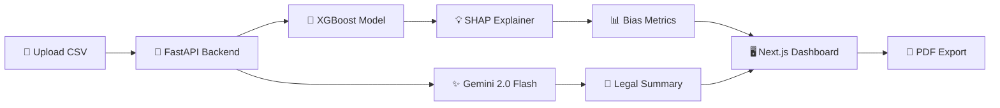
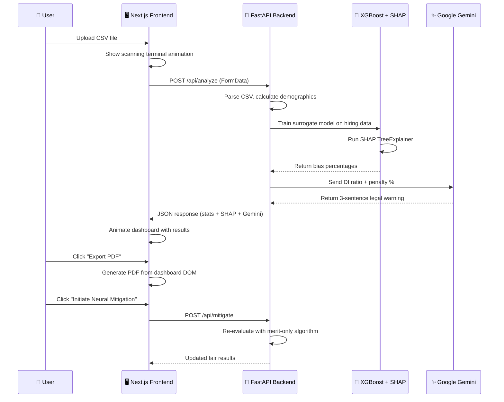

<div align="center">

# ⚖️ EquiScan

### AI-Powered Algorithmic Bias Auditing Platform

*Detect. Explain. Mitigate. Comply.*

<br/>


<br/><br/>

> **EquiScan** is an enterprise-grade legal-tech dashboard that detects, quantifies, and mitigates algorithmic bias in HR hiring systems using **XGBoost + SHAP** explainability and **Google Gemini 2.0** AI-generated legal compliance summaries.

</div>

<br/>

---

## 📸 Screenshots

<div align="center">

### 🌙 Dark Mode — Compliance Dashboard


<br/><br/>

### 🔍 AI Scanning Terminal


<br/><br/>

### ☀️ Light Mode — Upload Page


</div>

---

## ✨ Key Features

<table>
<tr>
<td width="50%">

### 🧠 XGBoost + SHAP Analysis
Trains a surrogate XGBoost model and uses **SHAP** to mathematically prove which demographic features cause bias — showing exact percentage penalties per group.

### ⚖️ EEOC Four-Fifths Rule
Automatically calculates the **Disparate Impact Ratio** and flags datasets that violate the 80% legal compliance threshold.

### 🤖 Google Gemini Integration
Sends real-time bias metrics to **Gemini 2.0 Flash** for an AI-generated executive legal warning displayed in a premium glowing card.

</td>
<td width="50%">

### 🔧 One-Click Mitigation
Applies a fairness algorithm that re-evaluates candidates **purely on merit**, blinding the model to gender and age with instant before/after comparison.

### 📄 PDF Export
Export the full compliance dashboard as a **professional PDF audit report** with one click — ready for legal records.

### 🌓 Dark / Light Mode
Premium dual-theme UI with an adaptive **Sage · Gold · Terracotta** color palette designed for extended viewing comfort.

</td>
</tr>
</table>

---

## 🔬 How It Works



<details>
<summary><b>🔍 Click to see the full analysis pipeline</b></summary>

<br/>



</details>

---

## 🏗️ Project Structure

```
EquiScan/
│
├── 🐍 backend/                     # FastAPI Server
│   ├── main.py                     # API endpoints (/api/analyze, /api/mitigate)
│   ├── ai_engine.py                # XGBoost surrogate model + SHAP explainer
│   ├── requirements.txt            # Python dependencies
│   ├── .env                        # 🔑 GEMINI_API_KEY (you create this)
│   └── scripts/
│       └── generate_data.py        # Generates 4 test CSV datasets
│
├── 🖥️ frontend/                    # Next.js 16 Dashboard
│   ├── src/
│   │   ├── app/
│   │   │   ├── layout.tsx          # Root layout (Inter + JetBrains Mono)
│   │   │   ├── page.tsx            # Main dashboard (all UI components)
│   │   │   └── globals.css         # Dual-theme design system
│   │   └── services/
│   │       └── api.ts              # Axios client + TypeScript interfaces
│   └── package.json
│
├── docs/images/                    # README screenshots
└── LICENSE                         # MIT
```

---

## 🚀 Quick Start

### Prerequisites

> **Required:** Python 3.10+ · Node.js 18+ · npm · Git

> **Optional:** [Google Gemini API Key](https://aistudio.google.com/apikey) (free — the app works without it using a fallback)

---

### 1️⃣ Clone & Enter

```bash
git clone https://github.com/Mhatreyash/EquiScan.git
cd EquiScan
```

### 2️⃣ Backend Setup

<details>
<summary><b>Click to expand backend instructions</b></summary>

```bash
# Navigate to backend
cd backend

# Create & activate virtual environment
python -m venv .venv

# Windows
.venv\Scripts\activate
# macOS / Linux
source .venv/bin/activate

# Install dependencies
pip install -r requirements.txt
```

#### Create `.env` file

```env
GEMINI_API_KEY="your-gemini-api-key-here"
```

> 🔑 Get a free key at [aistudio.google.com/apikey](https://aistudio.google.com/apikey)

#### Generate test datasets (recommended)

```bash
cd scripts
python generate_data.py
cd ..
```

This creates **4 test CSV files:**

| File | Scenario | Expected DI Ratio |
|---|---|---|
| `test_1_anti_female_bias.csv` | 🔴 Severe anti-female bias | ≈ 0.23 |
| `test_2_anti_male_bias.csv` | 🔴 Severe anti-male bias | ≈ 0.23 |
| `test_3_perfectly_fair.csv` | 🟢 Merit-only, no bias | ≈ 1.0 |
| `test_4_borderline.csv` | 🟡 Subtle bias (borderline) | ≈ 0.80 |

#### Start the server

```bash
uvicorn main:app --reload
```

✅ **Backend running at `http://localhost:8000`**

</details>

### 3️⃣ Frontend Setup

<details>
<summary><b>Click to expand frontend instructions</b></summary>

Open a **new terminal:**

```bash
cd frontend

# Install dependencies
npm install

# Start dev server
npm run dev
```

✅ **Frontend running at `http://localhost:3000`**

</details>

### 4️⃣ Use the App

```
1. Open http://localhost:3000
2. Drag & drop a CSV file (or use a test CSV from Step 2)
3. Watch the animated scanning terminal 🖥️
4. Explore the compliance dashboard 📊
5. Click "Export Official Audit (PDF)" 📄
6. Toggle ☀️/🌙 for theme switching
```

---

## 🔌 API Reference

<details>
<summary><b><code>POST /api/analyze</code> — Analyze a CSV dataset</b></summary>

#### Request
```
Content-Type: multipart/form-data
Body: file (CSV)
```

#### Response
```json
{
  "status": "success",
  "filename": "hiring_data.csv",
  "total_records": 1000,
  "risk_score": 88.5,
  "risk_status": "HIGH LEGAL RISK",
  "demographics": {
    "Male": { "count": 600, "approval_rate": 72.3 },
    "Female": { "count": 400, "approval_rate": 24.5 }
  },
  "disparate_impact_ratio": 0.34,
  "recommendation": "Model exhibits severe gender bias...",
  "ai_explanation": "SHAP analysis proves the model penalizes Females by -22.5%...",
  "gemini_legal_summary": "EXECUTIVE WARNING: The Disparate Impact Ratio of 0.34..."
}
```
</details>

<details>
<summary><b><code>POST /api/mitigate</code> — Apply fairness algorithm</b></summary>

#### Request
```
No body required. Uses the last uploaded dataset cached in memory.
```

#### Response
Same schema as `/api/analyze` with updated fair metrics.

</details>

### CSV Format

Your CSV **must** contain these columns:

```csv
Applicant_ID,Gender,Years_Experience,Interview_Score,AI_Hired
1,Male,5,78,True
2,Female,8,92,False
3,Male,3,65,True
```

| Column | Required | Type | Description |
|---|---|---|---|
| `Gender` | ✅ | string | `"Male"` or `"Female"` |
| `AI_Hired` | ✅ | boolean | `True` / `False` |
| `Interview_Score` | ✅ | integer | Used for merit-based mitigation |
| `Applicant_ID` | ❌ | integer | Auto-dropped during analysis |
| `Years_Experience` | ❌ | integer | Fallback merit column |

---

## 🧰 Tech Stack

<table>
<tr>
<td align="center" width="50%"><h3>🐍 Backend</h3></td>
<td align="center" width="50%"><h3>🖥️ Frontend</h3></td>
</tr>
<tr>
<td>

| Tech | Role |
|---|---|
| **FastAPI** | Async Python API |
| **XGBoost** | Surrogate classifier |
| **SHAP** | Feature explainability |
| **Gemini 2.0** | Legal AI summaries |
| **Pandas** | Data processing |
| **python-dotenv** | Env management |

</td>
<td>

| Tech | Role |
|---|---|
| **Next.js 16** | App Router framework |
| **Tailwind CSS v4** | Utility styling |
| **Framer Motion** | Animations |
| **react-countup** | Number animations |
| **react-to-pdf** | PDF export |
| **lucide-react** | Icon library |
| **Axios** | HTTP client |

</td>
</tr>
</table>

---

## 🎨 Design System

EquiScan uses a custom **CSS variable-driven** dual-theme system:

<table>
<tr>
<th>Token</th>
<th>Light Mode</th>
<th>Dark Mode</th>
<th>Usage</th>
</tr>
<tr>
<td><code>--color-safe</code></td>
<td> <code>#5a9a7a</code></td>
<td> <code>#6db990</code></td>
<td>✅ Compliant / Passed</td>
</tr>
<tr>
<td><code>--color-warn</code></td>
<td> <code>#b8883b</code></td>
<td> <code>#cda04e</code></td>
<td>⚠️ Moderate Risk</td>
</tr>
<tr>
<td><code>--color-danger</code></td>
<td> <code>#c0605a</code></td>
<td> <code>#d4746e</code></td>
<td>🔴 High Risk / Failed</td>
</tr>
<tr>
<td><code>--bg-primary</code></td>
<td> <code>#faf8f5</code></td>
<td> <code>#141418</code></td>
<td>Page Background</td>
</tr>
<tr>
<td><code>--color-accent</code></td>
<td> <code>#6b7fa6</code></td>
<td> <code>#8094b8</code></td>
<td>Accent / Neutral</td>
</tr>
</table>

---

## 🐛 Troubleshooting

<details>
<summary><b>❌ <code>ModuleNotFoundError: No module named 'xgboost'</code></b></summary>

Run `pip install -r requirements.txt` inside the activated virtual environment. Make sure `.venv` is active (you should see `(.venv)` in your terminal prompt).
</details>

<details>
<summary><b>❌ CORS error in browser console</b></summary>

Ensure the backend is running on `http://localhost:8000`. The FastAPI server includes `allow_origins=["*"]` CORS middleware.
</details>

<details>
<summary><b>❌ Gemini card doesn't appear</b></summary>

Check your `GEMINI_API_KEY` in `backend/.env`. The dashboard still works without it — the Gemini card simply won't render if the key is missing or invalid.
</details>

<details>
<summary><b>❌ <code>Cannot read properties of undefined (reading 'Male')</code></b></summary>

Your CSV is missing the `Gender` column, or the backend returned an internal error. Check the terminal running `uvicorn` for the full Python traceback.
</details>

<details>
<summary><b>❌ PDF export button does nothing</b></summary>

Clear your browser cache and retry. The PDF library (`react-to-pdf`) requires the dashboard DOM to be fully rendered before it can capture it.
</details>

---

## 🗺️ Roadmap

- [ ] Multi-demographic support (Race, Age, Disability)
- [ ] Database persistence (PostgreSQL)
- [ ] User authentication & audit history
- [ ] Vercel + Railway deployment
- [ ] Batch CSV processing
- [ ] SHAP waterfall chart visualization

---

## 🤝 Contributing

Contributions are welcome! Please open an issue first to discuss proposed changes.

```bash
# Fork → Clone → Branch → Code → PR
git checkout -b feature/amazing-feature
git commit -m "Add amazing feature"
git push origin feature/amazing-feature
```

---

<div align="center">

## 📄 License

MIT License — see [LICENSE](./LICENSE) for details.

**Built with ❤️ by [Yash Mhatre](https://github.com/Mhatreyash)**

© 2026

</div>
